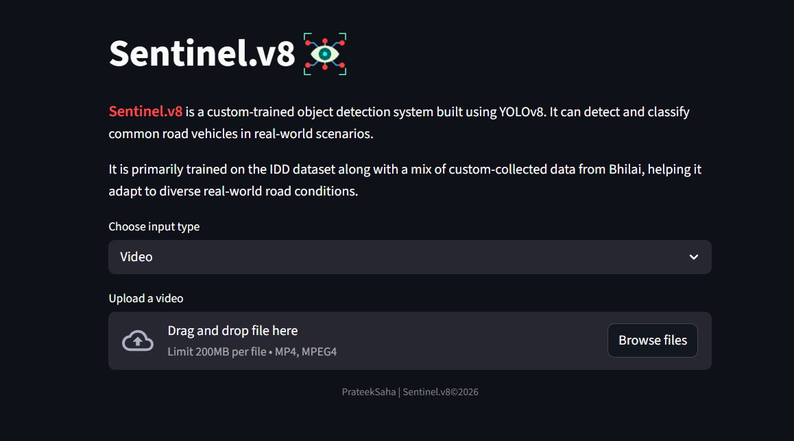
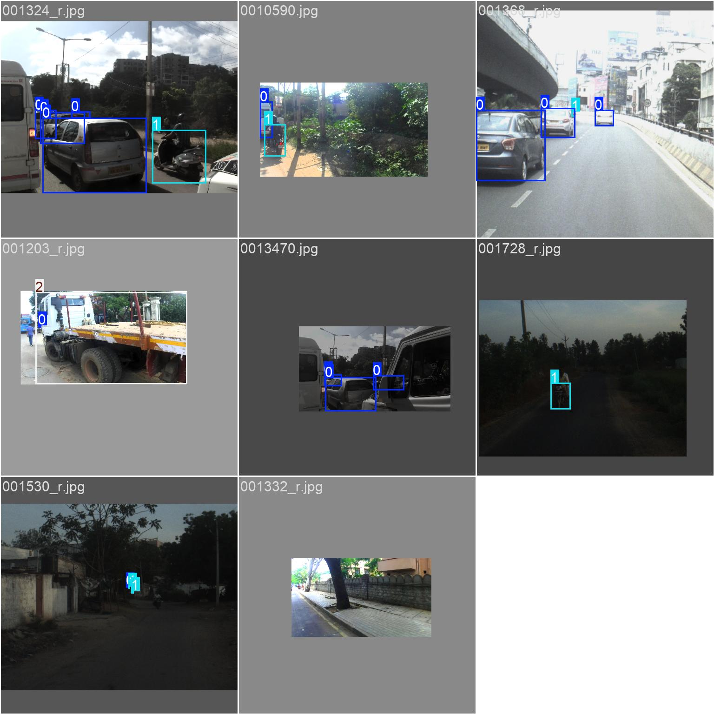
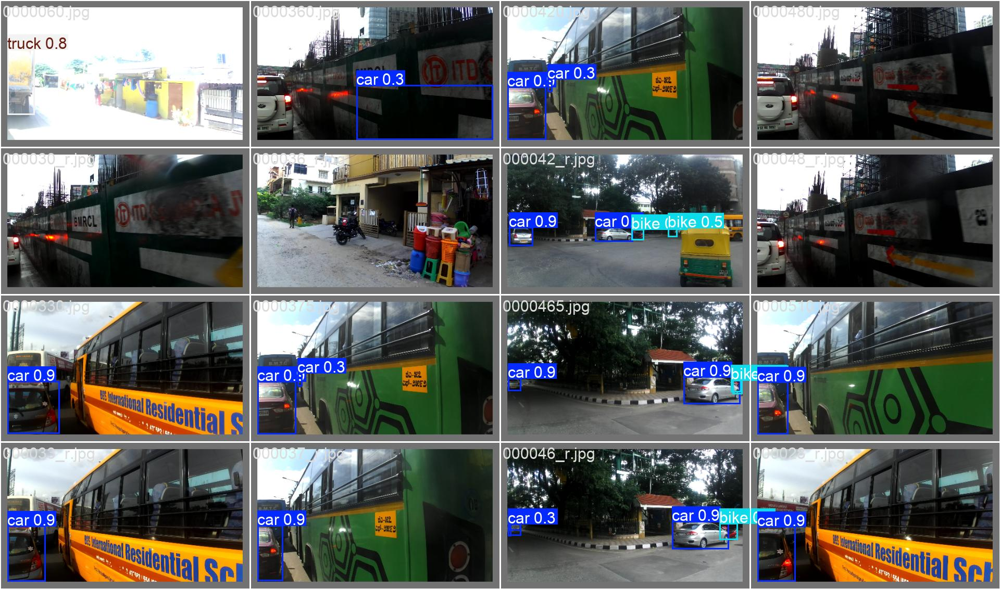
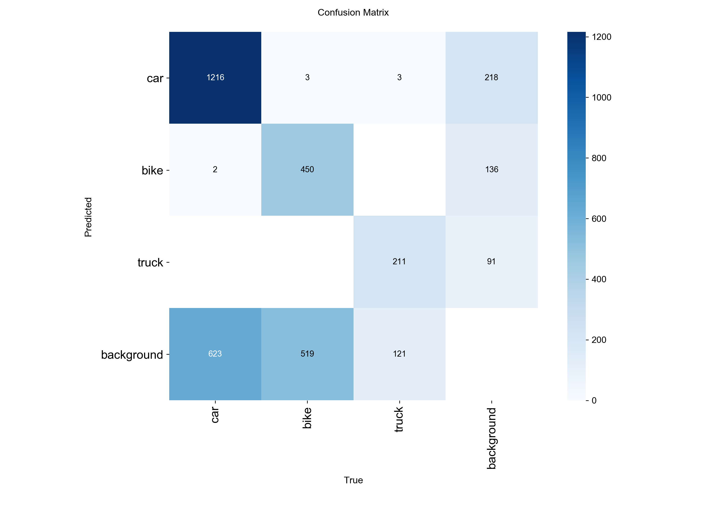
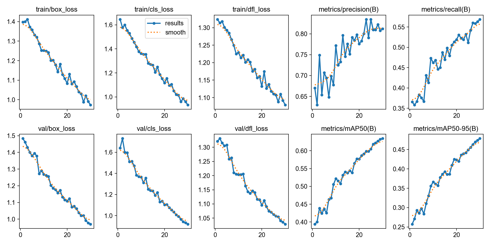

# ABOUT SENTINEL.v8
The goal Sentinel.v8 is to design and implement a reliable and efficient vehicle detection system capable of identifying and classifying multiple types of vehicles in real-world traffic scenarios. The system is built using a deep learning–based object detection model and aims to perform accurately across diverse viewpoints, including front, rear, and side perspectives.

A key goal of this project is to leverage a combination of publicly available datasets and custom-collected data to improve generalization and robustness. By incorporating varied environmental conditions, camera angles, and traffic densities, the model is trained to handle practical challenges such as occlusion, overlapping objects, and inconsistent object scales.



Another important objective is to create an end-to-end pipeline that not only focuses on model training but also includes data preprocessing, annotation conversion, dataset management, and deployment through a user-friendly interface. This ensures that the system is not limited to theoretical performance but is also usable in real-world applications.

The project also aims to optimize performance under hardware constraints, particularly CPU-based environments, by balancing accuracy and computational efficiency. This includes careful selection of model architecture, training parameters, and inference optimizations to ensure practical usability without requiring high-end hardware.

Ultimately, Sentinel.v8 is intended to serve as a scalable foundation for further enhancements, such as real-time traffic monitoring, intelligent transportation systems, and advanced analytics, while also demonstrating a complete workflow for building and deploying an object detection system from scratch.

# Data Flow

```plaintext
Raw Data → XML Annotations → Conversion → YOLO Labels → Sync → Dataset → Training → Model → Inference
```
The data flow in Sentinel.v8 represents the complete pipeline from raw dataset preparation to model training and local inference using the Streamlit interface.

## Data Preparation Flow
```plaintext
Raw Dataset (IDD folders + Custom Data)
        │
        ▼
XML Annotations (multiple folders like frontFar, rearNear, etc.)
        │
        ▼
Manual Selection / Folder-wise Processing
        │
        ▼
Conversion Script (XML → YOLO Format)
        │
        ▼
Class Filtering (car, bike, truck)
        │
        ▼
Generated YOLO Labels (.txt)
        │
        ▼
Image-Label Synchronization Script
        │
        ▼
Final Dataset (dataset/images + dataset/labels)
```

## Training Data Flow
```plaintext
Final Dataset (images + labels)
        │
        ▼
YOLOv8 Data Loader
        │
        ▼
Batch Processing
        │
        ▼
Model Training (Pretrained → Fine-tuned)
        │
        ▼
Loss Calculation (Box + Class + DFL)
        │
        ▼
Backpropagation
        │
        ▼
Updated Model Weights
        │
        ▼
Saved Model (best.pt)
```
## Inference Data Flow
```plaintext
User Input (Image / Video)
        │
        ▼
File Upload (Streamlit)
        │
        ▼
Saved to Local Input Folder
        │
        ▼
YOLOv8 Model Inference
        │
        ▼
Detection Output (Bounding Boxes + Classes)
        │
        ▼
Saved Output (runs/detect/)
        │
        ▼
Displayed in Streamlit UI
```

# Dataset Details
The dataset used in Sentinel.v8 is a combination of selected portions of the Indian Driving Dataset (IDD) and additional custom-collected data. The IDD dataset provides diverse real-world traffic scenarios, primarily from urban environments, with a significant portion originating from Bangalore. To improve relevance and adaptability, custom data was also incorporated, captured in Bhilai, introducing variation in road conditions and perspectives.

The dataset was not used in its entirety. Instead, specific subsets such as frontFar, rearNear, sideLeft, sideRight, and similar folders were processed individually. Each subset contains images along with corresponding annotations in Pascal VOC (XML) format. Due to inconsistencies and missing files in the original dataset, a filtering process was applied to ensure only valid image-label pairs were included.

Annotations were converted from XML format to YOLO format using a custom script. During this process, only selected classes were retained to simplify the detection task and improve model focus. The final dataset consists of synchronized image and label pairs organized into a structured directory suitable for YOLOv8 training.

After cleaning and filtering, the final training dataset contains approximately 1100+ images with corresponding annotations. The dataset includes variations in camera angles, object sizes, and traffic density, which helps the model generalize better across different real-world scenarios.

Overall, the dataset preparation process emphasizes quality over quantity, ensuring that the model is trained on consistent and relevant data while handling the limitations of incomplete or noisy annotations.

## Training Batch Samples


# Classes detected
The Sentinel.v8 model is trained to detect a limited set of vehicle classes to ensure focused learning and improved accuracy. During the dataset preparation phase, multiple object categories present in the original annotations were filtered, and only relevant vehicle types were retained.

The final set of classes used in the model includes:

* Car
* Bike (mapped from motorcycle)
* Truck

Class selection was intentionally restricted to reduce complexity and improve model performance, especially given the constraints of dataset quality and hardware limitations. During the annotation conversion process, original class labels from the dataset were mapped to a simplified class structure, ensuring consistency across all training samples.

This focused approach allows the model to perform more reliably on common road vehicles while minimizing confusion caused by less relevant or inconsistently labeled classes such as riders or pedestrians.

# Training configuratin

The Sentinel.v8 model was trained using the YOLOv8 framework with a focus on balancing performance and computational efficiency on a CPU-based system. A lightweight model variant was selected to ensure feasible training and inference within limited hardware resources.

Training was performed using a pre-trained YOLOv8 model as the starting point, allowing the system to leverage previously learned features and converge faster on the custom dataset. The model was then fine-tuned on the prepared dataset consisting of filtered and synchronized image-label pairs.

Key training parameters include:

* Model: YOLOv8 (nano variant)
* Initialization: Pre-trained weights (fine-tuning approach)
* Epochs: 30 (final training run)
* Image Size: 512 × 512
* Batch Size: Adjusted based on system capacity
* Device: CPU (AMD Ryzen 5 5600G)

The training process involved standard loss components used in YOLOv8:

* Bounding box loss for localization accuracy
* Classification loss for correct object labeling
* Distribution Focal Loss (DFL) for improved bounding box regression

Training progress was monitored using metrics such as precision, recall, and mean Average Precision (mAP). Based on observed trends, training was stopped at an optimal point where improvements began to stabilize, avoiding unnecessary computation without significant gains.

This configuration ensures a practical balance between training time and model performance, making the system suitable for real-world experimentation and demonstration without requiring specialized hardware.

The performance of Sentinel.v8 improved progressively across three training phases as the dataset size increased and training configurations were refined. Each phase contributed to better detection accuracy and model stability.

# Training Progression Overview

---
| Phase   | Dataset | Epochs | Precision | Recall | mAP50 | mAP50-95 |
|--------|--------|--------|----------|--------|------|----------|
| Initial | ~500  | 10     | 0.64     | 0.38   | 0.399 | 0.285 |
| Second  | ~900  | 25     | 0.78     | 0.60   | 0.669 | 0.285 |
| Final   | ~1100+| 30     | 0.81     | 0.56   | 0.63  | 0.47 |
---

### Initial Training Observations:
- Basic detection capability established
- High number of missed detections
- Limited generalization due to smaller dataset

### Second Training Observations:
- Significant improvement in detection accuracy
- Better recall indicating more objects detected
- Increased dataset size improved generalization
- Some inconsistencies remained in complex scenes

### Final Training Observations:
- Further improvement in precision and stability
- Better bounding box quality (reflected in mAP@50–95 increase)
- Slight drop in recall due to resolution reduction and dataset complexity
- More consistent predictions across different viewpoints

### Overall Analysis
- Precision improved steadily across all phases, reducing false positives
- Recall increased significantly from the first to second phase, then slightly decreased in the final phase
- mAP@50 saw major improvement early, then stabilized
- mAP@50–95 improved notably in the final phase, indicating better localization accuracy

### Key Insights
- Increasing dataset size had the most significant impact on performance
- Fine-tuning over multiple stages improved model stability
- Reducing image resolution helped achieve faster training within time constraints
- Further improvements are likely dependent on better data quality and class balance rather than longer training

## Features
- Detects multiple vehicle types including cars, bikes, and trucks
- Supports both image and video-based object detection
- Processes real-world traffic scenarios with multiple camera angles
- Provides bounding box localization with class labels and confidence scores
- Handles different perspectives such as front, rear, and side views
- Filters and focuses on selected classes for improved accuracy
- Uses a lightweight model suitable for CPU-based systems
- Allows batch processing of images during training and inference
- Generates and saves detection outputs for further analysis
- Integrates with a Streamlit-based interface for easy interaction
- Supports custom dataset training and iterative model improvement


## Supported input (images / video)
- Supports image input for object detection
- Supports video input for frame-by-frame detection
- Accepts common image formats such as .jpg and .png
- Accepts video formats such as .mp4
- Processes uploaded files through Streamlit interface
- Saves input files locally before inference
- Generates annotated output for both images and videos
- Displays processed results directly in the interface
- Handles short video clips efficiently on CPU-based systems

## Results & Observations
### Final Training Outputs

The following images represent the final outputs generated after training the model. These include validation results, confusion matrix, and prediction samples, which provide a visual understanding of model performance.





These outputs show how the model performs across different scenarios and classes. The validation batch images highlight bounding box predictions on unseen data, while the confusion matrix provides insight into class-wise performance and misclassifications.

* The model shows strong detection capability for cars, with relatively accurate bounding boxes and confidence scores.
* Bike detections are present but less consistent, especially in crowded or overlapping situations.
* Truck detection is comparatively weaker and depends heavily on visibility and size in the frame.

The results graph illustrates the training progression, including loss reduction and improvement in evaluation metrics over epochs. Overall, the outputs confirm that the model has learned meaningful patterns from the dataset while still leaving room for improvement in edge cases.


## Limitations
The current version of Sentinel.v8 demonstrates reliable performance in controlled scenarios, but it still has several limitations that affect its accuracy and consistency in real-world conditions.

The model shows a noticeable imbalance in performance across classes. Detection of cars is significantly stronger compared to bikes and trucks, primarily due to uneven representation in the dataset. This results in inconsistent predictions when dealing with less frequent or visually complex objects.

- Reduced recall indicates that the model misses a portion of objects, especially in dense traffic scenes
- Struggles with overlapping objects, particularly multiple bikes and riders in close proximity
- Limited truck detection when objects are small, partially occluded, or at a distance
- Occasional false positives, such as misclassifying static structures or background elements
- Performance varies across different camera angles, with weaker results in side and rear views

Another limitation arises from the dataset itself. The presence of missing images, inconsistent annotations, and the need for manual filtering introduces constraints on the overall data quality. While efforts were made to clean and synchronize the dataset, some inconsistencies may still impact model learning.

Additionally, the model is trained and executed on a CPU-based system, which limits both training speed and inference efficiency. This restricts the ability to scale the system for real-time high-resolution video processing.

Overall, while Sentinel.v8 is suitable for demonstration and foundational use, further improvements in dataset quality, class balance, and computational resources are required to achieve higher accuracy and robustness.

### Future Improvements
Sentinel.v8 provides a strong foundation for vehicle detection, but there are several areas where the system can be enhanced to improve accuracy, scalability, and real-world usability.

One of the primary areas of improvement is dataset quality and balance. Increasing the number of samples for underrepresented classes such as trucks and improving annotation consistency can significantly enhance detection performance. Incorporating more diverse scenarios, including different lighting conditions and traffic densities, would further improve generalization.

- Improve class balance by adding more samples for bikes and trucks
- Refine annotations to reduce inconsistencies and missing labels
- Include more diverse environmental conditions and viewpoints

From a model perspective, further optimization can be achieved by experimenting with larger YOLOv8 variants or adjusting training strategies. Fine-tuning hyperparameters and exploring data augmentation techniques could also lead to better performance.

- Experiment with larger model variants for improved accuracy
- Apply advanced data augmentation techniques
- Fine-tune hyperparameters for better convergence

In terms of functionality, the system can be extended to support real-time applications. Adding webcam-based detection and improving video processing efficiency would make the project more interactive and practical.

- Add real-time webcam detection support
- Optimize video inference for smoother performance
- Enhance the Streamlit interface with better visualization features

Finally, deployment and scalability remain key future goals. Hosting the application on a cloud platform and enabling remote access would allow broader usage and testing in real-world environments.

- Deploy the application for remote access
- Optimize for GPU-based environments for faster processing
- Extend the system for integration with traffic monitoring or analytics solutions

These improvements would transform Sentinel.v8 from a functional prototype into a more robust and production-ready system.

## Tech Stack

Sentinel.v8 is built using a combination of machine learning frameworks, programming tools, and libraries that support data processing, model training, and application development.

- Python as the primary programming language for all components
- YOLOv8 (Ultralytics) for object detection model training and inference
- PyTorch as the underlying deep learning framework
- OpenCV for handling image and video processing
= Streamlit for building the user interface
- NumPy for numerical operations and data handling
= XML ElementTree for parsing annotation files (Pascal VOC format)
- OS and Pathlib modules for file handling and directory management

The project is developed and executed in a local environment, with training and inference performed on a CPU-based system. The selected stack ensures ease of development while maintaining compatibility with the available hardware resources.


## Project Structure

The project follows a structured organization to separate dataset, model files, scripts, and application logic. This helps in maintaining clarity and ease of development.
```plaintext
Sentinel.v8/
│
├── dataset/
│   ├── images/          # Final training images
│   └── labels/          # YOLO format annotation files
│
├── models/              # Trained model weights (best.pt, last.pt)
│
├── input/               # Uploaded images/videos from Streamlit
│
├── output/              # Processed results (optional/manual use)
│
├── runs/                # YOLO training and prediction outputs
│
├── annotations/         # Raw XML annotations (can be removed after processing)
│
├── JPEGImages/          # Raw images (can be removed after processing)
│
├── app.py               # Streamlit application
├── convert.py           # XML to YOLO conversion script
├── sync.py              # Image-label synchronization script
├── dataset.yaml         # YOLO dataset configuration
│
└── README.md            # Project documentation
```
## How to Run

To run Sentinel.v8 locally, ensure that all dependencies are installed and the project structure is properly set up. The model and dataset should already be prepared before running the application.

- Install required dependencies using pip (Ultralytics, Streamlit, OpenCV, etc.)
- Place the trained model file inside the models directory
- Ensure dataset.yaml is correctly configured if retraining is needed

To start the Streamlit application:
```bash
streamlit run app.py
```
Once the application is running:
- Upload an image or video through the interface
- The file will be saved in the input directory
- The model performs detection on the uploaded file
- Output is generated and displayed within the interface

For training the model:
```bash
yolo detect train data=dataset.yaml model=models/best.pt epochs=30 imgsz=512
```
This setup allows the project to be executed entirely in a local environment without requiring deployment or external services.

## License

This project is intended for educational and experimental purposes. It demonstrates the implementation of an object detection system using custom-trained models and publicly available datasets.
- The codebase is open for modification and personal use
- The dataset used includes portions of the Indian Driving Dataset (IDD) along with custom-collected data
- Users should ensure compliance with the original dataset’s license and usage terms
- This project is not intended for commercial deployment in its current form
